# AI Nights Content - Beginner Track

## Workshop

## セッション情報

**タイトル:** 見る、聞く、話す、または理解することができるアプリケーションを Microsoft Cognitive Services で作成する

**Session Abstract:** このワークショップでは、[Microsoft Azure Cognitive Services](https://azure.microsoft.com/en-gb/services/cognitive-services/) を紹介します。これは、コードをスクラッチで構築する必要なく、インテリジェンスと機械学習をアプリケーションに導入するための一連のサービスです。[Computer Vision](https://azure.microsoft.com/en-gb/services/cognitive-services/directory/vision/) や [Text Analytics](https://azure.microsoft.com/en-gb/services/cognitive-services/directory/lang/) といった事前に学習済みの AI の API があり、REST プロトコルによってアクセスできます。次に、転送学習を使用したカスタム AI - [Microsoft Azure Custom Vision](https://azure.microsoft.com/en-gb/services/cognitive-services/custom-vision-service/) について説明します。これにより、少量の独自のデータで画像分類モデルのトレーニングができます。ワークショップの締めくくりとして、独自に学習した AI を組み込んだアプリケーションを構築に [Logic Apps](https://azure.microsoft.com/en-gb/services/logic-apps/)を使用します。このテクノロジーは、機械学習モデルを使ったデータパイプラインプロセスを構築するのに理想的です。

## マシンの前提条件

* ハンズオンに必要な画像やコードサンプルを取得するために、このリポジトリーをローカルマシーンにクローン（ `https://github.com/beachside-project/ai-nights-biggner-track-custom-vision.git` ）するか、または、このリポジトリーの緑色の 'Clone or Download' ボタンをクリック > 'Download ZIP' をクリックしてください。
* [Microsoft Azure Subscription](https://azure.microsoft.com/en-gb/free/)
* モダンブラウザー(Google Chrome, Microsoft Edge)

> *すべてのデモとコンテンツは Windows PC 上でのみ動作確認済みですが、macOS と Linux でも実行可能の想定です。WIndows 以外の OS でフィードバックがある場合は、issue または pull request で情報をご提供ください。*  

## セクション :

* **Task 1:** Microsoft Azure Cognitive Services - Custom Vision [Go to Section](#task-1-microsoft-azure-cognitive-services---custom-vision)
* **Task 2:** 独自の AI をアプリケーションに組み込む - Azure Logic Apps [Go to Section](#task-2-独自の-ai-をアプリケーションに組み込む---azure-logic-apps)

> このコンテンツが役に立ちそうでしたら、**ボーナスコンテンツ**に進んでみましょう: [**ボーナスコンテンツはこちら**](bonus-content.md)

## Task 1: Microsoft Azure Cognitive Services - Custom Vision

Microsoft Azure Custom Vision サービスを使用すると、ごくわずかなコードで独自のパーソナライズ画像分類、およびオブジェクト検出のアルゴリズムを構築できます。ここでは、[スタンフォード大学によって作成された [ImageNet オープンデータセット](http://vision.stanford.edu/aditya86/ImageNetDogs/)の中から犬の画像を使用して、犬種分類アルゴリズムを作成します。

7つの犬種それぞれ30枚づつの画像があります（[こちらのzip フォルダ](sample-images/dogs.zip)の zip ファイルにあります）。

* Beagle
* Bernese Mountain Dog
* Chihuahua
* Eskimo Dog (aka Husky)
* German Shepherd
* Golden Retriever
* Maltese

[zip フォルダ](sample-images/dogs.zip) の中には、トレーニング用の画像以外にテスト用の画像もあります。

最初に、Azure のアカウントを使って Custom Vision のインタンスを作成します。

* [Azure Portal](https://ms.portal.azure.com) のダッシュボードを開く
* 左上にある 'リソースの作成' をクリック
* 「Custom Vision」と入力して検索
* Custom Vision と記載されたペインをクリック.
* 詳細を入力
  * 任意の名前を入力 
  * 自身のサブスクリプションを選択 
  * **[重要]** 「**(米国）米国中南部**」 を選択
  * '予測価格レベル' と 'トレーニング価格レベル' では「S0」を選択
  * リソースグループの下の '新規作成' をクリックし、「ainights」と入力して 'OK' をクリック
  * '作成' をクリック
* 

これで分類器を作成できるようになりましたので、[https://www.customvision.ai](https://www.customvision.ai/) へ進みサインインしてください。サインイン後、画面右上の自身のアカウントをクリックし、'DIRECTORIES' が先ほど作成した Azure の ディレクトリになっていることを確認します。

> 利用規約に同意の上お進みください。

画面が表示されたら、'NEW PROJECT' をクリックして詳細入力ウィンドウを開き、以下を参考に入力します。

* Name: 任意の名前を入力（例:「dog classifier」）
* Description: 任意に説明を入力
* Resource Group: Custom Vision を作成する Resource Group を選択（例:「ainights[SO]」）
* Project Types: 「Classification」
* Classification Types: 「Multiclass (Single tag per image)」
* Domains: 「General」
* 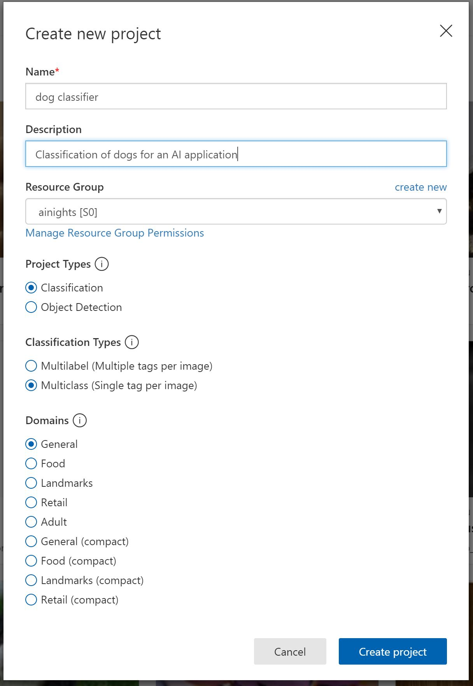

'Create Project' をクリックします。以下のように空のワークスペースが表示されます。

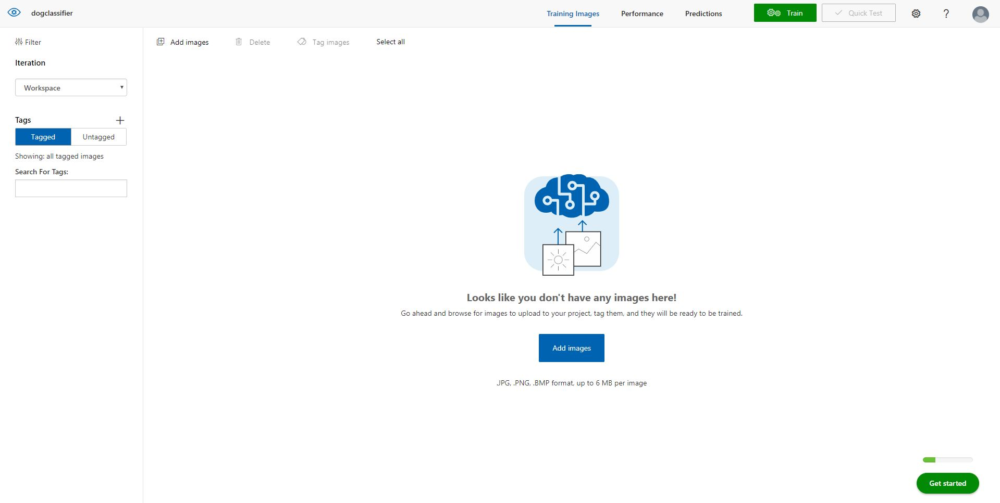

次は、画像の追加とタグの割り当てをして画像分類器を作成します。

画面左上の 'Add images' をクリックして、[サンプル画像のsample-images/dogs.zipフォルダー内](sample-images/dogs.zip) の最初のフォルダー - Beagle - を開き、フォルダー内の30枚の画像を選択します。

'My Tags' に「beagle」と入力して、'Upload 30 files' をクリックします。

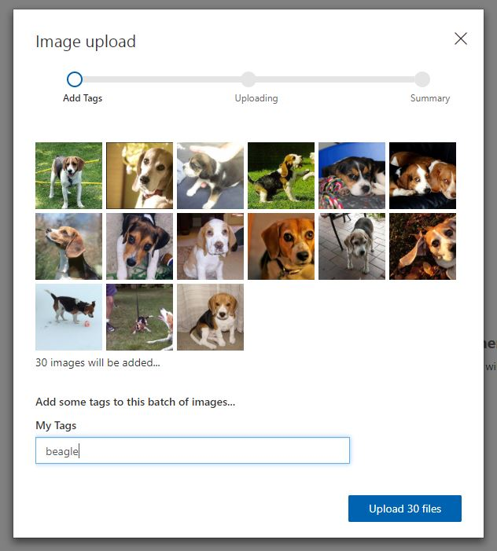

成功すると、確認メッセージが表示されます。ワークスペースで画像を確認することができます。

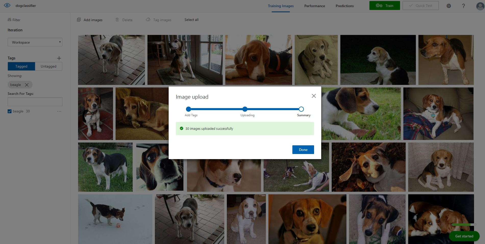

同じ手順で、フォルダー内の他の 6つの犬種の画像をそれぞれタグ付けしてアップロードします:

* 'Add images' をクリック
* 新しい30枚の犬の画像を選択
* 'My Tags' に犬種を入力 (beagle, german-shepherd, maltese などフォルダーの名前を入力)
* 'Upload 30 files' をクリック
* ワークスペースへアップロードされた画像を確認

これですべてのカテゴリーがアップロードできたら、左側に犬のクラスが表示され、犬の画像の種類に応じてフィルタリングできるようになります。

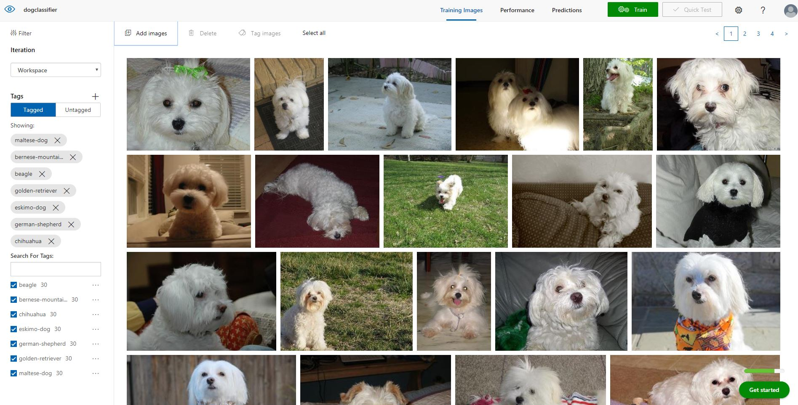

アップロードした犬の画像データを使ってアルゴリズムを訓練する準備が整いました。右上隅にある緑色の 'Train' ボタンをクリックしてください。

トレーニングプロセスが完了したら 'Performance' タブに遷移します。ここで、訓練したモデルの機械学習の評価指標を見ることができます。

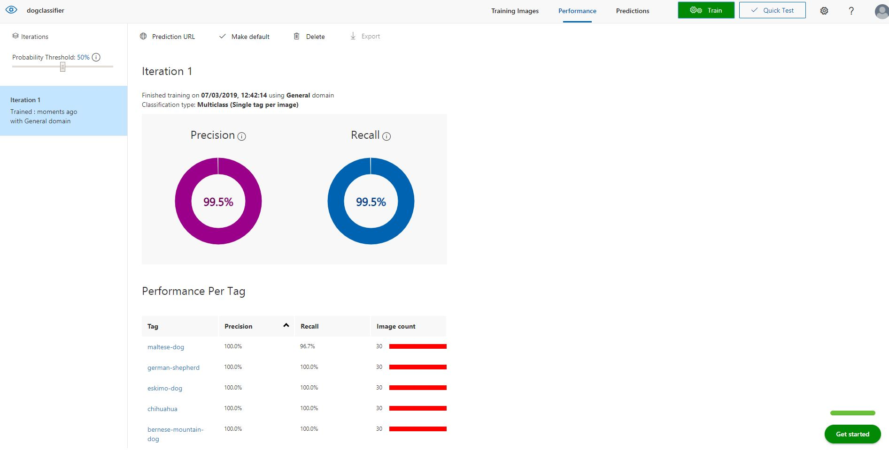

テストに必要なモデルができました。右上（ 'Train' ボタンの横）にある 'Quick Test' ボタンをクリックします。ローカルの画像を選択したり URL を入力することができるウインドウが表示されます。

テストフォルダー内（dog.zip内の `testset` ）の画像を参照してアップロードします。画像が分析され、何の犬だったか（ Predictions 内の Tag列）および、その結果に対する信頼性（ Predictions 内の Probablity 列）の結果が返されます。

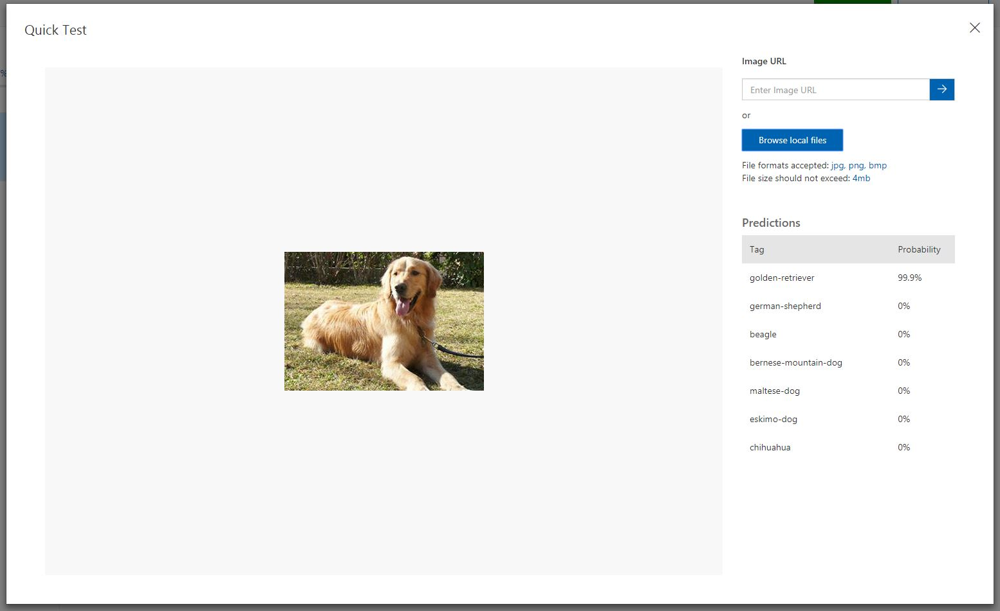

> モデルの性能を確認するには、テストフォルダー内の他の画像でこの手順を繰り返します。

上部のツールバーの **'Predictions'** をクリックすると、送信した全てのテスト画像が表示されます。このセクションで、新しいデータを取得した時にモデルのパフォーマンスを向上のために画像を追加して再トレーニングすることができます。画像は重要な順に並べられています。正しく分類された画像は、モデルに追加された最も新しい情報が画像が先頭に表示されます。一方、最後のイメージは、既に学習済みの他のイメージとよく似ている可能性があるため、正しく分類することはそれほど重要ではありません。

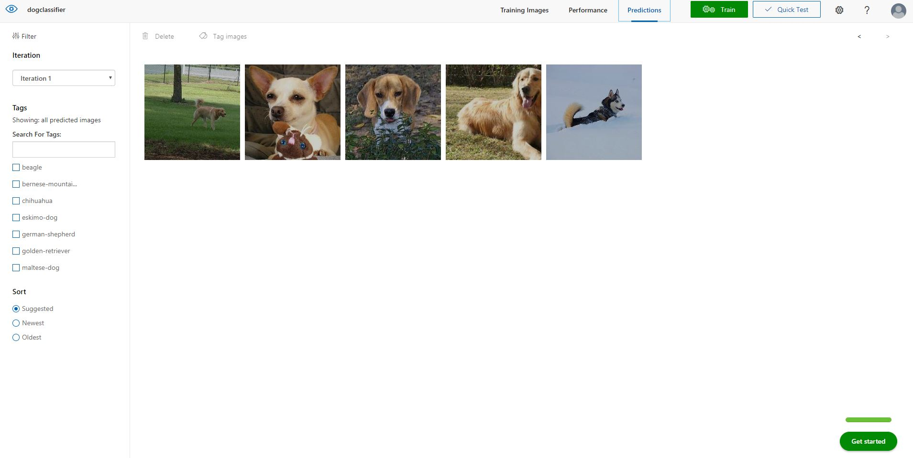

モデルにこれらの画像を追加するには、画像を選択し、モデルが出した結果を確認してから、'My Tags' に正しいタグを入力して 'Save and close' をクリックします。

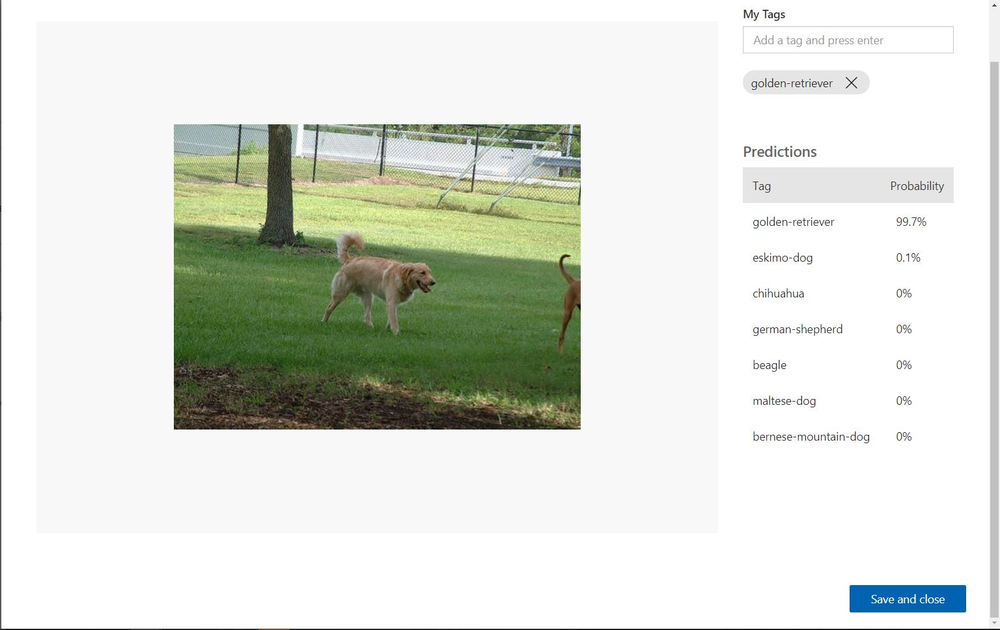

この画像は Predictions タブから消え、Training Images タブに追加されます。いくつかの画像とタグを追加したら、モデルを再トレーニングして改善するかどうかを確認できます。

アプリケーションでこのモデルを使うには、予測の詳細をみる必要があります。上部のバーの Performance タブに移動し、 **Publish** をクリックし、 公開するイテレーションを判別するために名前を入力します。

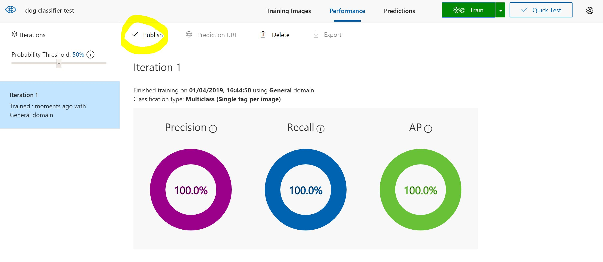

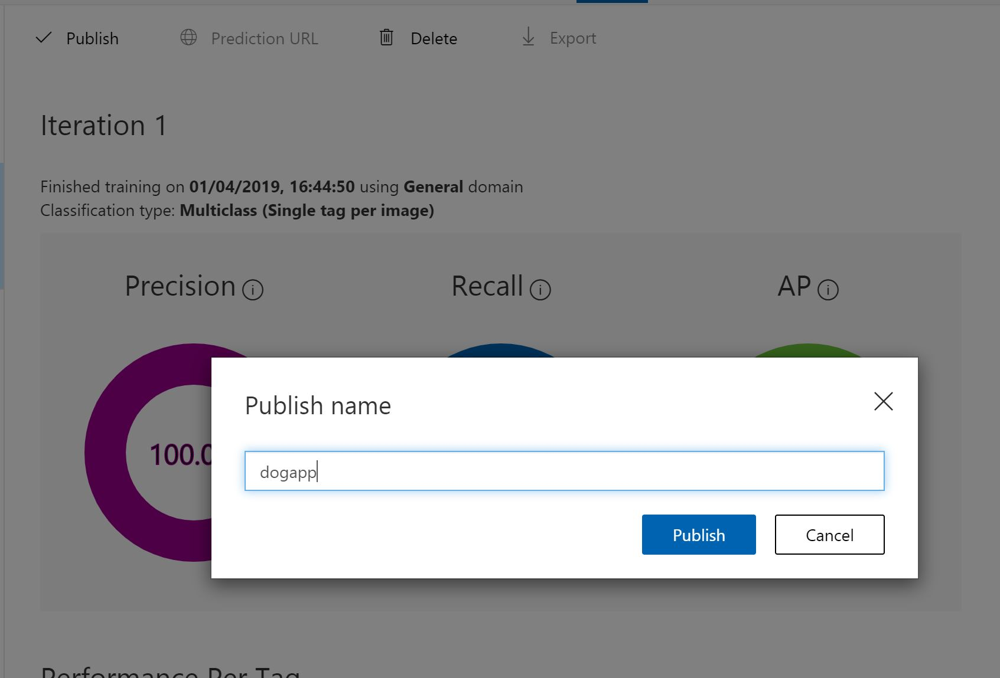

**Prediction URL** をクリックすると、（画像または画像のURLを使って）Postman で API を呼ぶための URL、ヘッダーやBodyといった設定の全ての情報を得ることができます。

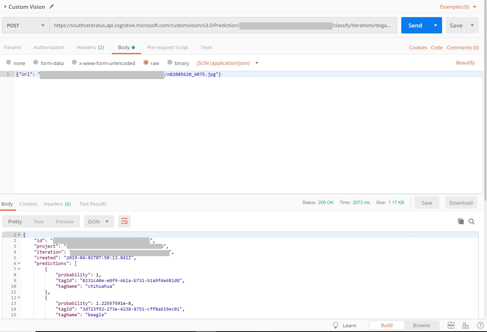

**おめでとうございます！** Azure Custom Vision サービスを使用して、自分だけの特別な犬の分類モデルを作成することができました。

## Task 2: 独自の AI をアプリケーションに組み込む - Azure Logic Apps

このセクションでは、Custom Vision AI dog classification アプリケーションを読み込む Azure Logic Apps を構築します。

まず、2つの Azure ストレージアカウントが必要です。

Azure ポータルに移動し、左上左のコーナーにある 'リソースの作成' をクリックします。'ストレージ' セクションをクリックし、最初のオプションである 'ストレージアカウント' を選択します。

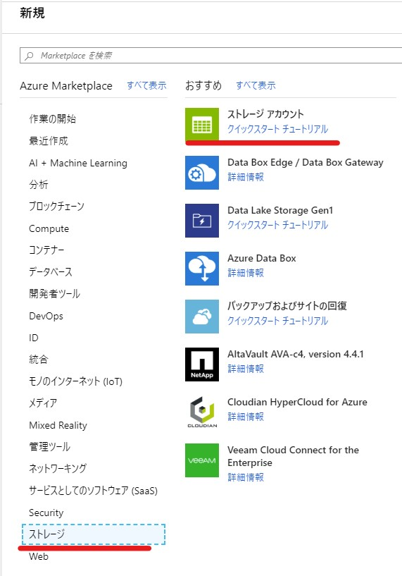

2つのストレージアカウントを作成します:

* 一つは、処理を開始するために画像を置くためのものです (「ainightstor」と名前を付けます)。
* もう一つは、処理の結果をアップロードするためのものです (「resultainights」と名前を付けます)。

> 以下のプロセスを **2回** 実行し、2つのストレージアカウントを作成します。

'ストレージ アカウントの作成' ページで 以下の内容を入力します:

* **サブスクリプション:** 自身のサブスクリプションを選択
* **リソースグループ:** このワークショップで利用しているリソースグループを選択 (例 ainights)
* **Sストレージアカウント名:** (入力必須) 全て英小文字のみで入力。 *例として「ainightsstor(yourname)」や「resultsainights(yourname)」です。一意の名前になるよう自身の名前などを末尾に入力します（かっこは削除してください）。*
* **場所:** 任意の場所を選択
* **パフォーマンス:** Standard
* **アカウントの種類:** Blob Storage
* **レプリケーション:** ローカル冗長ストレージ (LRS)
* **Access Tier:** ホット

**確認および作成** をクリックし、検証に成功したら **作成** をクリックします。

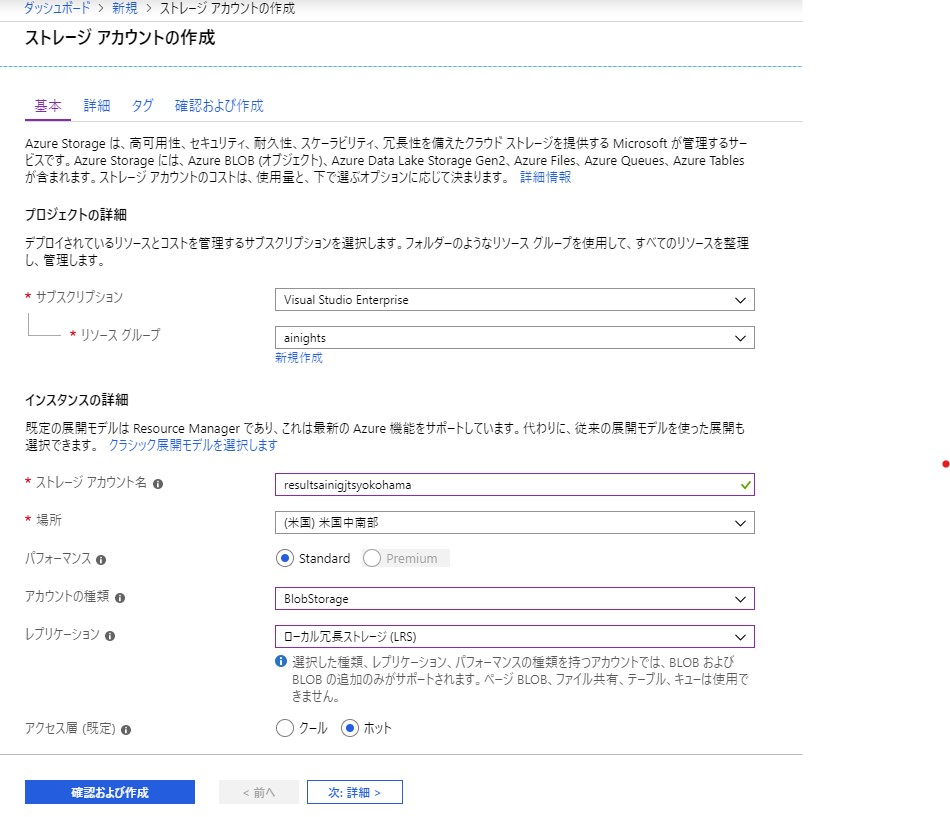

デプロイが完了したら、リソースへ移動し、アカウントの設定を確認します。
**Blob** を選択してからのストレージアカウントを確認します。

画像や結果を保存するには、ストレージアカウントにコンテナーを追加する必要があります。

**+ コンテナー**をクリックし、コンテナーの名前を作成します。

Select the **+ Container** button and create a name for the container

> 例として **ainightsstor(your name)** アカウントには **images** と付けます。
> 例として **resultsainights(your name)** アカウントには **results** と付けます。

パブリックアクセスレベルは **コンテナー（コンテナーと Blob の匿名読み取りアクセス）** を設定します。

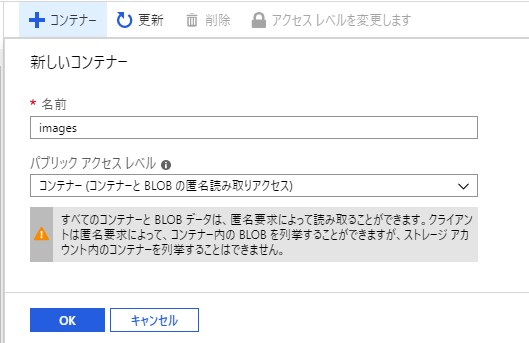

> 同様の設定で、画像用のストレージアカウントと結果用のストレージアカウントの設定を行います。

ここから Logic App の作成を行います。画像用のストレージアカウントの画像を AI 画像分類サービスを送信し、その結果を結果用のストレージアカウントに保存します。

Azure Portal のホームページに遷移します。Event Grid を使います。これは、Azure のサブスクリプション内のトリガー（今回だとストレージアカウントで新しい Blob が作成されたとき）を検知するサービスです。利用する前に Event Grid の登録が必要です。

左のパネルで **サブスクリプション** を選択し、自身のサブスクリプションを選択します。**リソースプロバイダー** をクリックするとリソースプロバイダーの一覧が表示されます。検索に 「event」と入力し **Microsoft.EventGrid** を選択します。

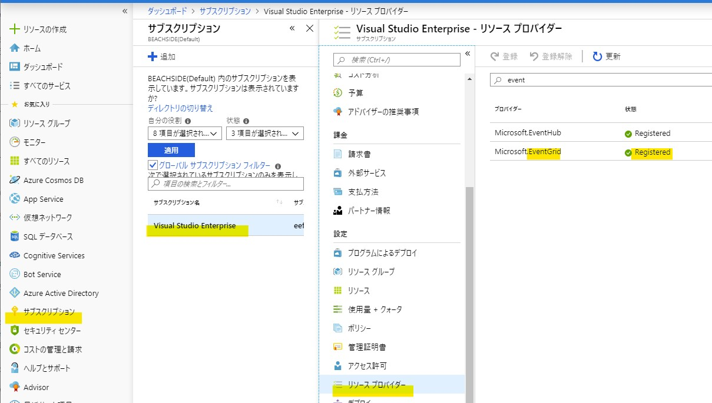

'NotRegistered' の場合は、ツールバーの **登録** をクリックし、'Registered' にします。

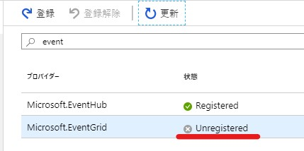

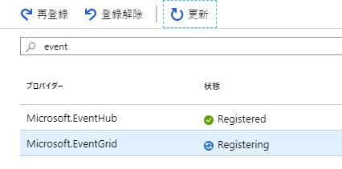

緑色のチェックマークで 'Registered' になったら（変わらない場合は、'更新' ボタンをクリックしてみましょう）、Azure Portal のホームページに戻ります。**リソースの作成** をクリックしして「Logic App」と入力して検索し '作成' をクリックします。

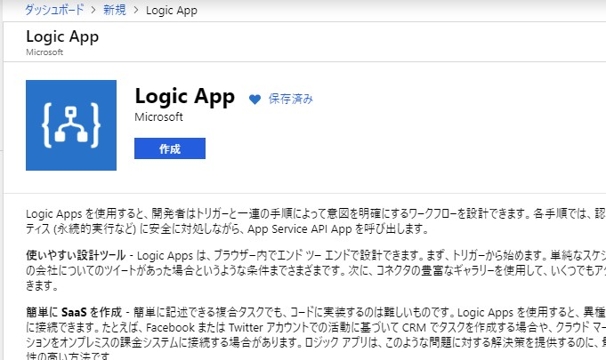

Logic App を作成します。設定の詳細は以下を参照ください:

* **名前:** 任意の名前を入力
* **サブスクリプション:** 自身のサブスクリプションを選択
* **リソースグループ:** '既存のものを使用'を選択し、このワークショップで利用しているリソースグループを選択します（例: ainights）。
* **場所:** 任意のデータセンターを選択
* **Log Analytics:** off

**作成** をクリックします。

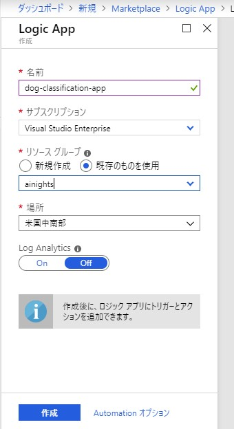

作成したら、リソースに移動します。**Event Grid のリソースイベントが発生するとき** を選択します。

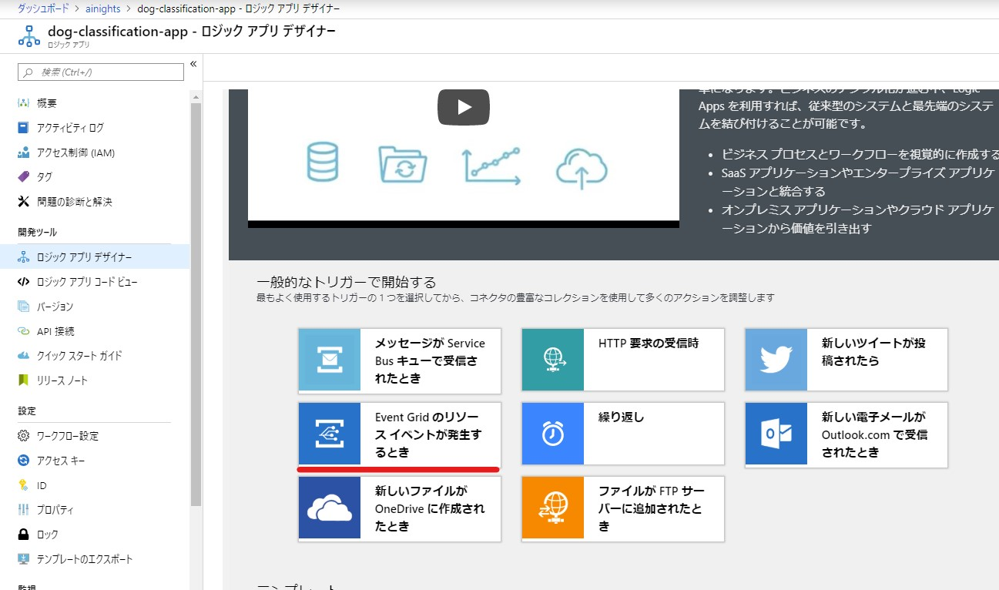

Azure の資格情報を使ってサインインし、Event Grid に接続します。

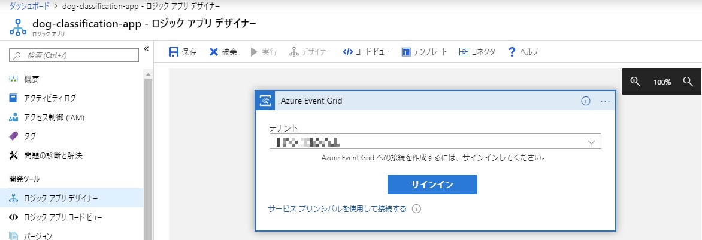

以下を参考に入力します:

* **サブスクリプション:** 自身のサブスクリプション
* **リソースの種類:** Microsoft.Storage.StorageAccounts
* **リソース名:** 画像用のストレージアカウント (例: ainightsstor(your name))
* **イベントの種類 項目 - 1:** Microsoft.Storage.BlobCreated

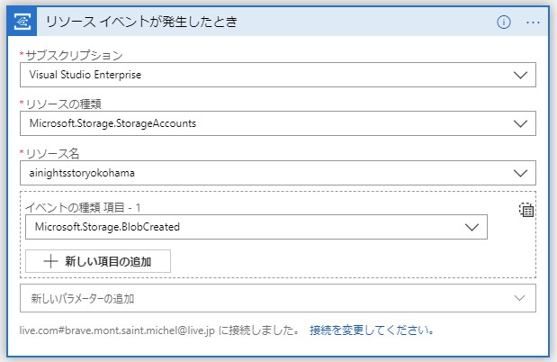

**新しいステップ** をクリックします。**josn の解析** と入力します（Json の後に半角スペースが入ります）。'データ操作' カテゴリーの 'JSON の解析' をクリックします。

* **コンテンツ:** '動的なコンテンツの追加' をクリックし、**本文** を選択
* **スキーマ:** [logic-app-schema1.json ファイル](sample-code/logic-app-task/logic-app-schema1.json)の値を入力

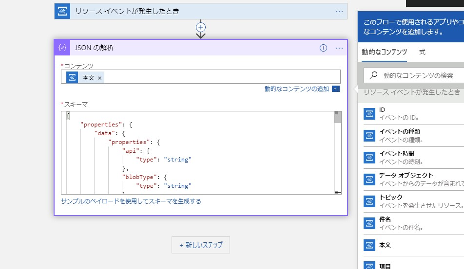

**新しいステップ** をクリックします。**custom vision** と入力し、**Classify an image url (プレビュー)** を選択します。

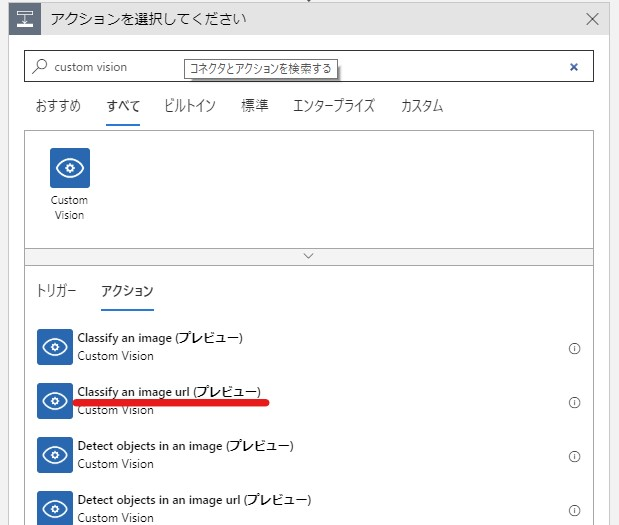

Custom Vision の接続設定がない場合、接続の設定が表示されます。

[https://www.customvision.ai](https://www.customvision.ai/) で **Performance** タブをクリックし、**Prediction URL** をクリックします。ここで Prediction Key と Site URL の情報が取得できます。**また、左パネルに記載のある Publish Name（下図で 'Iteration1'）をメモしておきましょう。次の手順で利用します。**

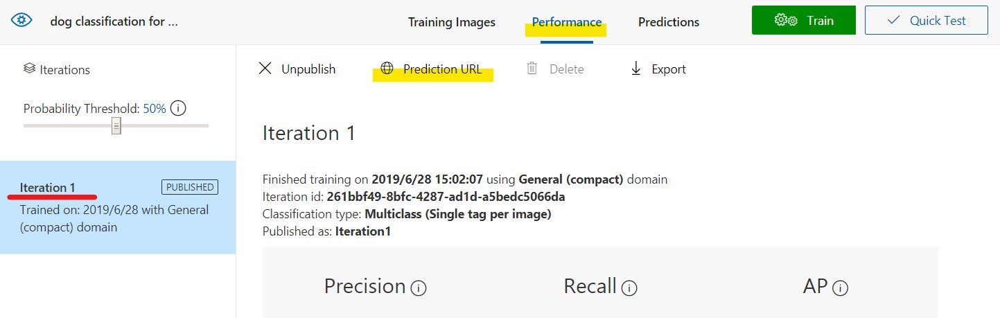

接続情報を以下を参考に入力します:

* **接続名:** 任意の名称を入力（例: ainights-dog-cassification）
* **Prediction Key:** Prediction Key の値を入力
* **Site URL:** URL を入力します。末尾は、 `**.api.cognitive.microsoft.com` です。それ以降のパスは不要です。

**作成** をクリックします。

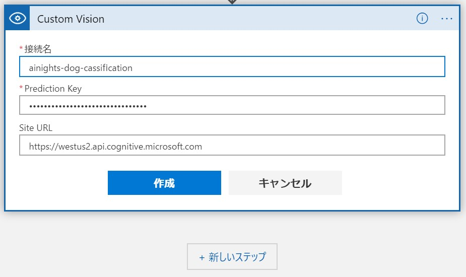

次は、Custom Vision の詳細を入力します。

* **Project ID:** Custom Vision のポータルで右上の設定のアイコンをクリックして開き、Project Id の値を入力
  * 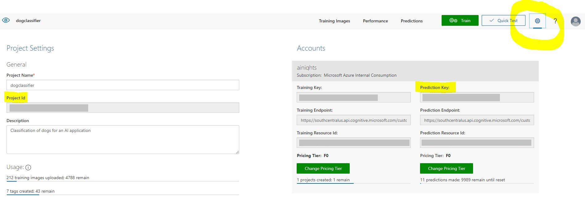
* **Published Name:** 前述の操作で確認した **Published Name** を入力
* **Image URL:** '動的なコンテンツの追加' をクリックし 'JSON の解析' の中の **url** をクリック
  * 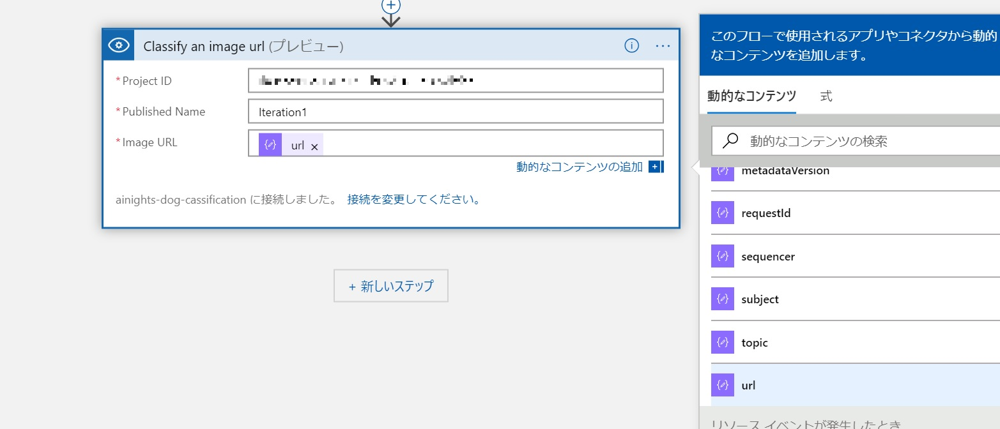

**新しいステップ** をクリックします。

「For each」と入力し、'制御' カテゴリーをクリックして、灰色の **For each** をクリックします。
'以前の手順から出力を選択' のボックスをクリックして '動的コンテンツなコンテンツの追加' をクリックし、**Predictions** をクリックします。

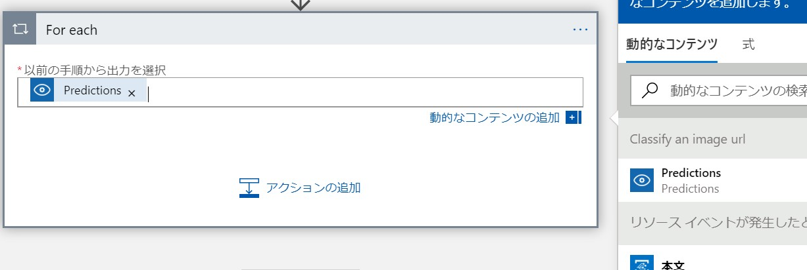

**アクションの追加** をクリックします。

'制御' のアイコンをクリックし、その中から **条件** をクリックします。

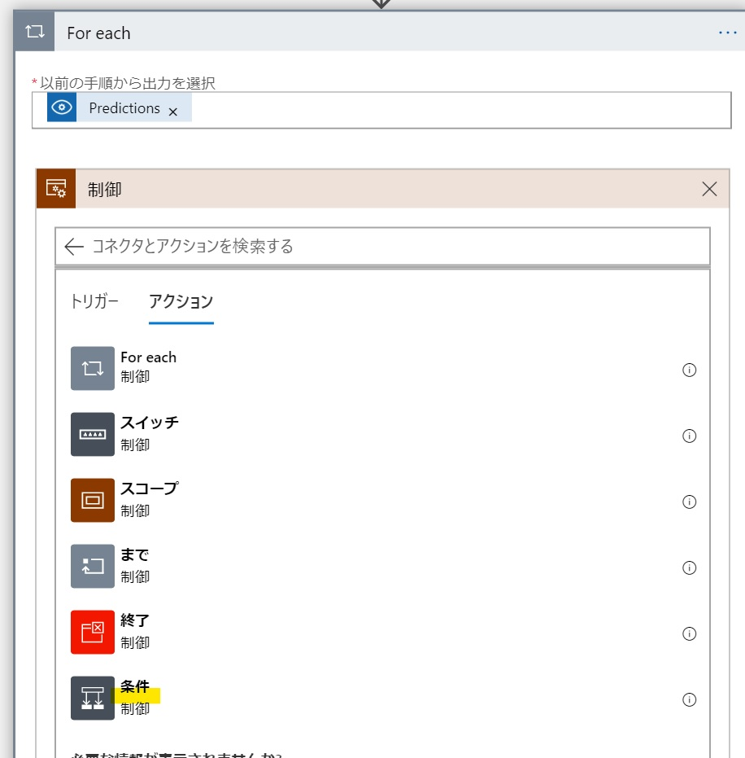

条件に、**Predicition Probability** が、0.7 より大きくなるよう設定します。

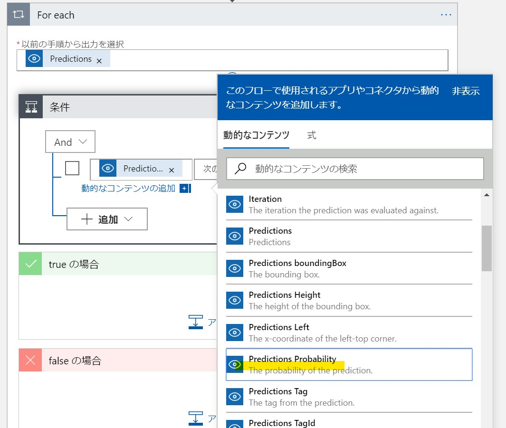

**ture の場合** のボックスで **アクションの追加** をクリックします。

「azure blob」と入力して 'Azure Blob Storage' をクリックし、**Blob の作成** をクリックします。

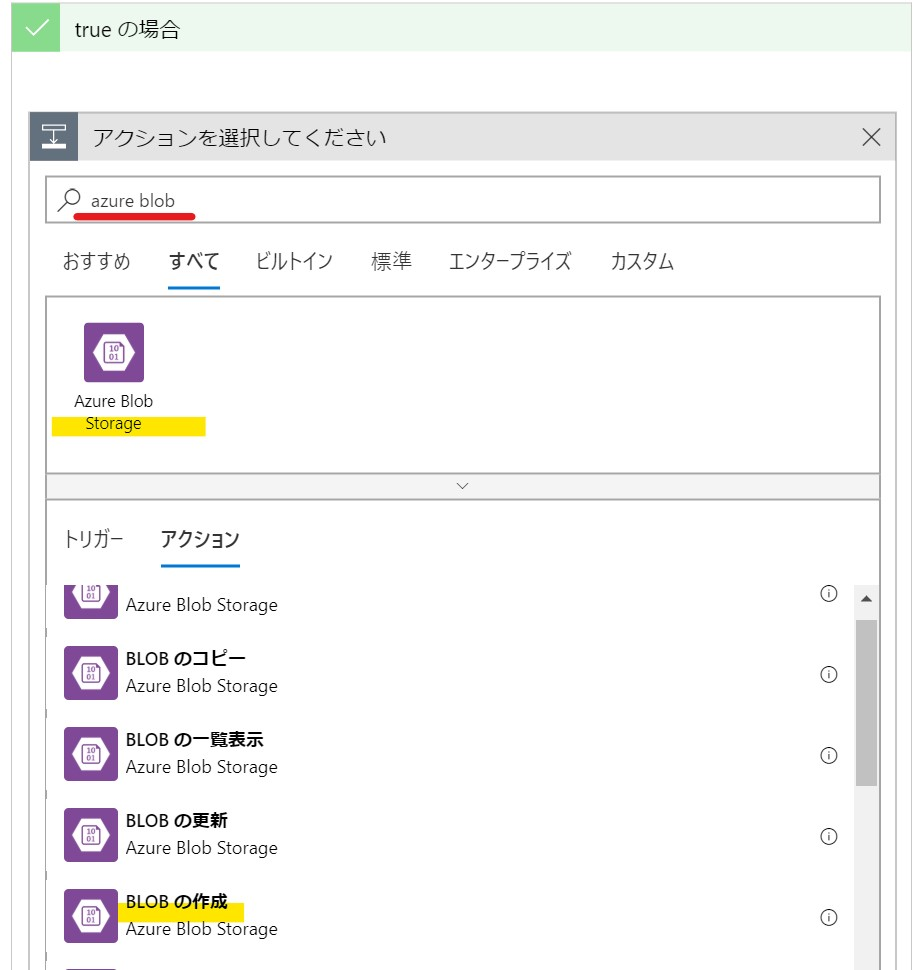

接続名に **results** と入力し、結果用の Blob Storage を選択し、**作成**をクリックします。

フォルダーパスには、右側にあるフォルダーアイコンを選択し、先ほど作成したコンテナー（例: /results）を選択します。

Blob 名のフィールドで「result-」と入力し、そのまま '動的なコンテンツの追加' をクリックして、'Classify an image url' の中から **id** をクリックします。

Blob コンテンツでは、フィールドをクリックして '動的なコンテンツの追加' をクリックし、'Classify an image url' の中の **もっと見る** をクリックします。**Predictions Tag** をクリックした後「 : 」と入力し、**Predictions probability** をクリックします。

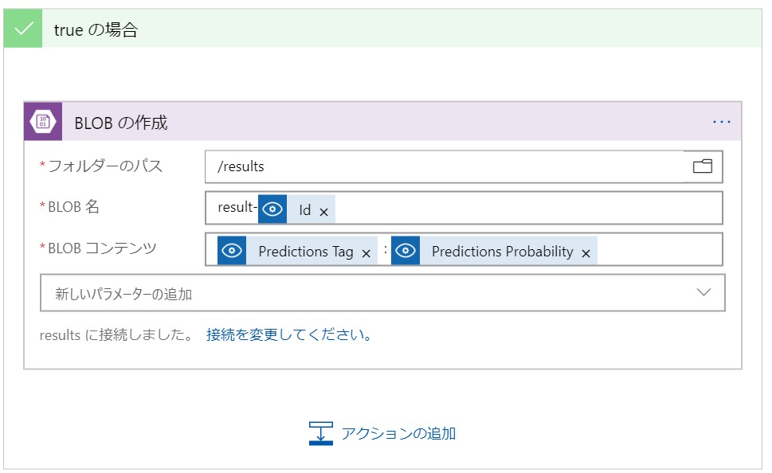

最後に上部のアクションバーで '保存' をクリックします。

保存したら想定通りに動くかテストしましょう。上部のアクションバーで **実行** をクリックします。

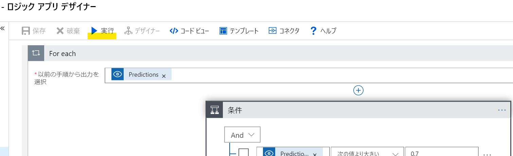

画像用のストレージアカウントに移動します（リソースグループのセクションから簡単に見つけることができます）。
'BLOB' を選択し、'images' のコンテナーをクリックします。'アップロード' をクリックし、Dogs データの testset フォルダーから画像を1つアップロードします。

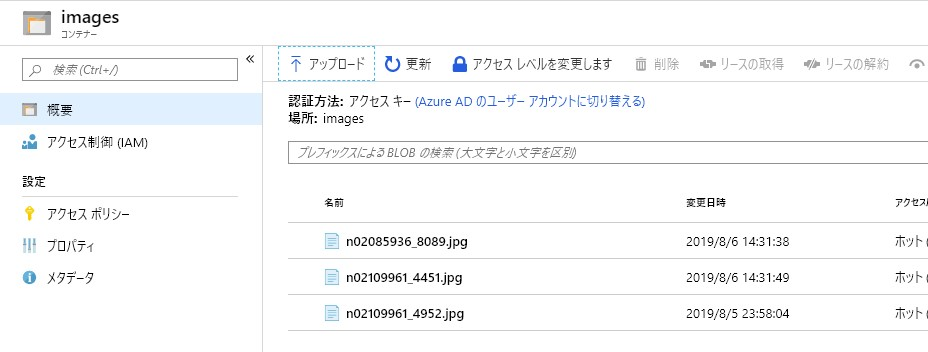

アップロードしたら、 Logic App リソースの '概要' ページへ戻り、画面下部の '実行履歴' を確認します。成功した実行履歴をクリックし、入出力を確認してみましょう。
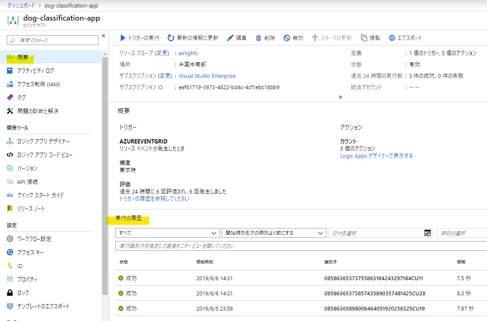

全てのセクションに緑色のチェックマークがあり、各セクションをクリックしてレイヤー間の入出力を見ることができます（これは期待通りに動作しなかった時の最適なデバッグ方法でもあります）。

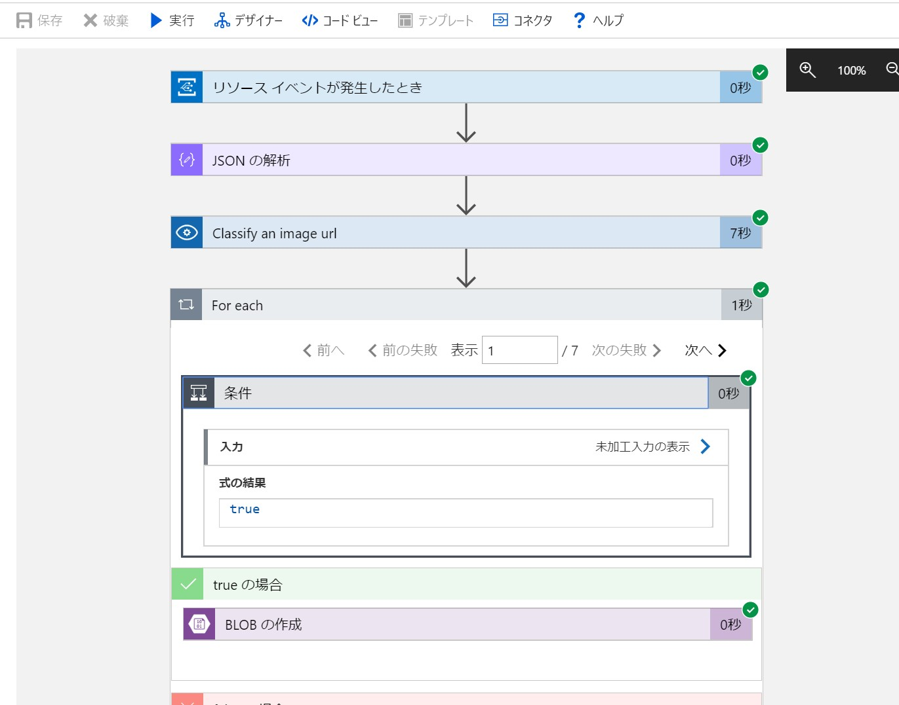

最後に結果用の Blob のストレージアカウントに移動します。'BLOB' を選択し、'results' のコンテナーをクリックしてファイルが生成されていることを確認します。ファイルは以下のように、'予測したクラス: 信頼度のスコア' が表示されます。

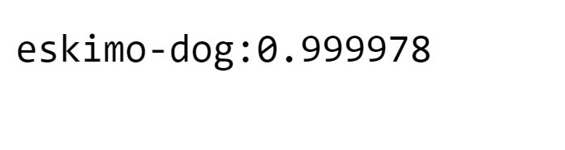

## BONUS コンテンツが利用できます

このセッションをお楽しみいただき、Azure Cognitive Services の詳細をもっと知りたい場合は、以下の3つのトピックについての[ボーナスコンテンツ](bonus-content.md)を用意しています。

* [Azure Cognitive Services を活用する](https://docs.microsoft.com/ja-jp/azure/cognitive-services/)
* [Cognitive Services in Containers](https://docs.microsoft.com/ja-jp/azure/cognitive-services/cognitive-services-container-support)
* [Microsoft PowerApps の構築](https://docs.microsoft.com/ja-jp/powerapps/#pivot=home&panel=maker/)

ボーナスコンテンツは [**こちら**](bonus-content.md) からご覧ください！

## Clean up resources

最後に、今後これらのリソースが不要の場合は、リソースグループを削除することでリソースを一括で削除できます。これを行うには、このワークショップのリソースグループを選択し、'リソースグループの削除' を選択して、削除するリソースグループの名前を確認します。
