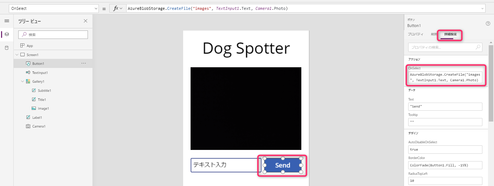

# AI Nights **ボーナス** コンテンツ - Beginner Track

## マシンの前提条件

* デモに必要な画像とコードサンプルを入手するために、このリポジトリをあなたのローカルマシンにクローンしてください。

  ```:bash
  git clone https://github.com/beachside-project/ai-nights-biggner-track-custom-vision.git
  ```

* [Microsoft Azure Subscription](https://azure.microsoft.com/ja-jp/free/) をご用意下さい。
* モダンなブラウザー (Google Chrome, Microsoft Edge) がインストールされていること。
* [Postman](https://www.getpostman.com/downloads/) がインストールされていること。
  * Postman は API Development Environment です。Windows, Linux や macOS で利用可能です。
* docker がインストールされていること。
  * [Docker Desktop for Windows](https://docs.docker.com/docker-for-windows/)
  * [Docker Desktop for Mac](https://docs.docker.com/docker-for-mac/)
  * [Docker Engine - Community](https://docs.docker.com/install/)

> *すべてのデモやコンテンツは Windows でテストしていますが、MacOS や Linux で動作するようオプションを設定しています。もし他のオペレーティングシステムでのフィードバックがありましたら、issue やプルリクエストを通じて情報を提供いただけますと幸いです。*

## セクション一覧:

* **Task A:** Microsoft Azure Cognitive Services - Computer Vision [セクションへ](#task-a-microsoft-azure-cognitive-services---computer-vision)
* **Task B:** Microsoft Azure Cognitive Services - Text Analytics in a Container [セクションへ](#task-b-microsoft-azure-cognitive-services---text-analytics-in-a-container)
* **Task C:** Microsoft PowerApps [セクションへ](#task-c-microsoft-power-apps)

## Task A: Microsoft Azure Cognitive Services - Computer Vision

このタスクでは、ウェブサイトのデモオプションを使って Cognitive Services を試します。

このページを開きます: [https://azure.microsoft.com/ja-jp/services/cognitive-services/directory/vision/](https://azure.microsoft.com/ja-jp/services/cognitive-services/directory/vision/)


ここには、それぞれのセクションを試すためのたくさんのデモがあります。（画像内のシーンとアクティビティの認識、OCR、顔検出、表情検出、Video indexer など）

**Computer Vision** の下の **画像内のシーンおよびアクティビティ認識** のとなりの **デモ** というリンクをクリックします。（また、ここには様々なサービスを知るための他のデモのリンクもあります。）


ここでは、指定された画像にどのような情報があるかを検出するデモを体験できます。上図に示す画面の左側には対象の画像が表示され、検出されたオブジェクトが矩形で示されていることがわかります。また右側には検出されたデータが表示されています。

それでは、 **参照** ボタンをクリックし、 `sample-images/computer-vision-web-browser` ディレクトリの **cat.jpeg** または **city.jpeg** をアップロードします。

例えば **cat.jpeg** をアップロードすると、下図のように猫がオブジェクトとして検出されていることがわかります。また右の欄の情報から、猫が検出された旨を読み取ることができます。


## Task 2: Microsoft Azure Cognitive Services - Text Analytics via REST

つぎに、これらのサービスをアプリケーションに組み込むことを想定して、 REST プロトコルを用いて体験してみましょう。

まず、[Microsoft Azure](https://azure.microsoft.com/ja-jp/) にサインインし、右角にある **ポータル** をクリックして開きます。

次に、ポータルの左上にある **リソースの作成** をクリックし、検索欄で **Cognitive Services** を入力し候補から **Cognitive Services** を選択します。それから、Cognitive Services ブレードの **作成** をクリックします。


Cognitive Services のアカウントを作成するために詳細を入力します:

* **名前:** サービス名を入力する（例: ainightscognitive ）
* **サブスクリプション:** 利用するサブスクリプションを選択する
* **場所:** 最寄りの利用可能なデータセンターの場所を選択する（例: (アジア太平洋) 東日本）
* **価格レベル:** S0
* **リソースグループ:** '新規作成'をクリックし、リソースグループの名前を入力する（例: ainights ）
* **規約を読み、「以下の通知を読み、理解しました。」のチェックボックスにチェックする**
* **'作成' をクリックする**


作成が完了したら、通知（画面右上）を開き、 **リソースに移動** をクリックします。


Cognitive Services のページで、 **キー**　をクリックし、 **キー 1** をコピーします。


つぎに、左ペインから **概要** を開き、エンドポイントの値をコピーします。


Postman をダウンロードしインストールし、ローカルマシンに API の作業環境を整えます。

> Postman についてはこちら [マシンの前提条件 セクション](#マシンの前提条件) に掲載したリンクから、ダウンロードしてください。

Postman を開き、図中のウィンドウが表示されている場合は「Create New」タブの **Request** を選択します。ウィンドウが表示されていない場合は、左上の「New」をクリックすると表示されます。


下図のようにリクエストの詳細を入力し、 **+ Create Collection** をクリックし "Text Analytics Samples" と名前を入力します。


作成した collection を選択し、 **Save to Text Analytics Samples** をクリックして保存します。


つぎに、 Text analytics API を呼び出すリクエストを作成します:

* 左上の GET リクエストを POST リクエストに変更する
* URL入力欄に、前述でコピーしたエンドポイントの URL を入力し、続いて `text/analytics/v2.0/sentiment` を入力する
* URL入力欄の下の Headers タブを開く
* キーに `Ocp-Apim-Subscription-Key` を入力し、値に前述でコピーした **KEY1** を入力する
* キーに `Content-Type` を入力し、値に `application/json` を入力する

* 

* URL入力欄の下の Body タブを開く
* `raw` のラジオボタンを選択する
* `sample-code/cognitive-services-api-task/sentiment-analysis-text.json` の JSON をコピーし Body 入力欄にペーストする
* `Send` ボタンをクリックし、レスポンスを確認する。ポジティブな文は `score` が高く、ネガティブな要素が含まれている文は `score` が低く判定されていることがわかります。

* 

また、REST API からほかのオプションを試すこともできます。例えば、 KeyPhrases 機能です。 URL の末尾を `sentiment` から `keyPhrases` に変更し、 `Send` をクリックしてキーフレーズの結果を確認しましょう。

* 

> Text Analytics API の言語のサポートについては、[こちら](https://docs.microsoft.com/en-gb/azure/cognitive-services/text-analytics/language-support/)からご参照ください。もしお使いの言語がサポートされていれば、JSON ファイルを編集してテキストを翻訳し、APIの動作を確認してみて下さい。例として、フランス語の JSON ファイルが `sample-code/text-analytics-demo/sentiment-analysis-text-fr.json` です。適宜変更してください。

> もし Postman を利用するにあたり問題があれば、 [sentiment analysis](https://northeurope.dev.cognitive.microsoft.com/docs/services/TextAnalytics.V2.0/operations/56f30ceeeda5650db055a3c9/) や [key phrase extraction](https://northeurope.dev.cognitive.microsoft.com/docs/services/TextAnalytics.V2.0/operations/56f30ceeeda5650db055a3c6/) の API ドキュメントからいつでも REST API のリクエストを発行することができます。利用しているデータセンターを選択し、Postman で利用したキーや body のサンプルを入力してご利用ください。

## Task B: Microsoft Azure Cognitive Services - Text Analytics in a Container

このデモはこの Azure ドキュメントに基づいたものです: [Install and run Text Analytics containers](https://docs.microsoft.com/en-us/azure/cognitive-services/text-analytics/how-tos/text-analytics-how-to-install-containers/)

このデモを実行するために、お手元のマシンに Docker をインストールする必要があります。

* [Download docker for your local machine here - available on Windows, Linux and macOS](https://docs.docker.com/docker-for-windows/)

Docker のインストーラーを実行し、ダウンロードが開始されたら、このように実行状況を確認することができます。


インストールされたら、 Docker を起動してください。（Windows の場合は、スタートメニューで `docker` と入力し、 Docker Desktop を選択します。）Docker デーモンが起動しているか確認してください。

Windows の場合は、タスクバーの通知領域（日付と時間の表示の近く）に Docker のアイコンが表示されていれば起動できています。


Cognitive Services Text Analytics API をローカルで実行するために、Docker イメージを取得する必要があります。コマンドプロンプトを開き、任意のディレクトリの配下で下記コマンドを実行してください。（もし適したディレクトリがなければ、 `AI-Nights` というディレクトリを作成するとよいでしょう。）

```
docker pull mcr.microsoft.com/azure-cognitive-services/sentiment:latest
```

すると、ローカルのレジストリに対して、Docker イメージのダウンロードが開始されます。


> もし下図のようなエラーが発生する場合、 `docker` コマンドを実行する前に Docker デーモンが起動しているかをよく確認してください。確認するには [Getting Started Guide from Docker Here](https://docs.docker.com/docker-for-windows/) をお試しください。


ダウンロードが終わったら、指定した文章の感情スコアを得るためにコンテナを実行する準備をしましょう。

コンテナを起動するためには、前章で利用した **Cognitive Services エンドポイント** と **API キー** が必要になります。

> このコンテナがローカルで動いていることを確認したい場合は、インターネットの接続を切断してお試しください。

`docker run` コマンドは、下記（または、 [このファイル](sample-code/cognitive-containers/run-container-command.txt) ）のようになります。データセンターと API キーの値は適宜置換え、実行してください。

```
docker run --rm -it -p 5000:5000 --memory 4g --cpus 1 mcr.microsoft.com/azure-cognitive-services/sentiment Eula=accept Billing=https://<datacenter-here>.api.cognitive.microsoft.com/text/analytics/v2.0 ApiKey=<key>
```

このコンテナはあなたのローカルマシンで実行されています。

クエリの詳細を把握するには、この OpenAPI（旧 Swagger）の定義を確認してください: [http://localhost:5000/swagger/index.html](http://localhost:5000/swagger/index.html)


API をテストするには、Postman で新しいリクエストを作成します:

* POST
* URL: http://localhost:5000/text/analytics/v2.0/sentiment
* Headers:
  * Content-Type : application/json
  * 

* Body:
  * [前章](sample-code/text-analytics-demo/sentiment-analysis-text.json)のサンプル JSON を入力します
  * 

コンテナを停止するには、コマンドラインに戻り **CTRL + C** を入力してください。このようにアプリケーションが終了したことが確認できます。


## Task C: Microsoft Power Apps

### 犬の写真を撮って分析するフロントエンドアプリケーションを作成する

> 補足: PowerApps を利用するには組織アカウントが必要です。

[https://powerapps.microsoft.com/en-us/](https://powerapps.microsoft.com/en-us/) を開き、PowerApps 組織アカウントでサインインします。

サインインすると、PowerApps のメインメニュー画面に遷移します。 **キャンバス アプリを一から作成** ボタンを選択します。


アプリ名に **例: Dog Spotter** と入力し、形式に **電話** を選択して **作成** ボタンをクリックしてください。


下図のような画面がロードされます。専用のインターフェースで、クリックとドラッグのインターフェースでアプリケーションを構築することができます。


アプリケーションの作成を始めるには、機能を追加する必要があります。下図のように画面上部に **挿入** のメニューををクリックして機能を追加していきます。


まず、 **カメラ** 機能を追加しましょう。挿入タブにある **メディア** のドロップダウンを開き、 **カメラ** オプションを選択します。


カメラをページの適当な位置に配置し、画面の右側に表示されているプロパティペインを確認しましょう。

プロパティペインの **詳細設定** タブを選択します。 **アクション** の **OnSelect** の欄に下記を記入します。

```
Collect(myPics, Camera1.Photo)
```


次に、アプリケーションにタイトルを追加します。 **挿入** タブの **テキスト** のドロップダウンメニューを開き、 **ラベル** を選択します。


画面上部にタイトルを配置します。右側のプロパティペインで下記のようにオプションを編集します:

* **テキスト:** Dog Spotter (またはお好きなアプリケーション名)
* **フォントサイズ:** 60
* **テキストのアライメント:** 中央

> プロパティペインの他の部分を変更することにより、アプリケーションの見た目や情報を変更することができます。オプションが利用できるかどうかはご確認ください。このチュートリアルで操作する部分はほんの一部にすぎません。


次に **フォトギャラリー** を追加しましょう。写真が撮影されたらアプリケーションの下部に表示されるようにします。

**挿入** タブの **ギャラリー** を選択します。 **横** を選択し、カメラの下に配置します。


どの画像を使用するかをアプリケーションに伝えるため、カメラのセットアップで作成した **myPics** 変数を利用します。

プロパティペインで、 **データソース** のドロップダウンメニューから **myPics** を選択します。


次にギャラリーの画像スロット単体を選択し、プロパティペインの **詳細設定** タブを選択します。下記のようにフィールドに記入します。

* OnSelect: ` Remove(myPics, ThisItem) `
* Image: ` ThisItem.Url `


次に挿入タブの **テキスト** から **テキスト入力** を追加します。この入力ボックスは、写真を Azure Blob Storage に送信するときに画像に名前を付けるために使用します。


**テキスト入力** をカメラの下、ギャラリーの上に配置します。

最後に **ボタン** を追加します。 **挿入タブ -> コントロール -> ボタン** を選択します。

ボタンを、カメラの下のテキスト入力ボックスの横に配置します。


ボタンのプロパティペインで、 **テキスト** を **Send** に編集します。


次に、データソースとして Azure Blob Storage を追加します。これは、アプリケーションのカメラで撮影した画像をそのストレージに送信し、 Logic app のトリガにするための仕組みにします。

ツールバーの **ビュー** を開き、 **データ ソース** を選択すると、データ ソースペインが表示されます。


データ ソースペインの検索欄に **blob** と入力し、表示された Azure Blob Storage オプションを選択します。


本編の Logic App のシナリオで使った Azure Blob Storage アカウントへの接続情報を入力します。 例 ainightsstor 。Azure ストレージアカウントのアクセスキーは、Azureポータルで当該のストレージアカウントを開き、メニューの **設定 -> アクセス キー** から **key1** の **キー** の値を使用してください。入力を終えたら、 **作成** ボタンをクリックします。


認証されると、データソースペインに AzureBlobStorage が追加されます。


それでは、この接続を組み込みましょう。 **Send** ボタンを選択し、 **詳細設定** ペインを開きます。

OnSelect 欄に下記のように入力します:

```
AzureBlobStorage.CreateFile("images", TextInput1.Text, Camera1.Photo)
```



さて、開発環境でテストできる状態までアプリケーションを作成できました。それでは、下図のように、画面右上のツールバーから **アプリのプレビュー** （再生）ボタンをクリックしましょう。画面が変わり、アプリケーションが起動します。なお、テストをするためにカメラへのアクセスを許可する必要があるかもしれません。


> 犬の写真（または他の何か）を撮影してテストしてみましょう。カメラの画像が映ってる部分をクリックすると写真が撮影できます。撮影したら、テキスト入力ボックスに画像の名前（例: dog.png ）を入力し、 Send ボタンをクリックします。しばらくすると Logic App が作動し、分析結果が保存されるでしょう。


それでは、モバイルデバイスで利用できるようにアプリケーションを **保存** して **共有** しましょう。

上部の **ファイル** タブを開き、左ペインから **保存** を開きます。そして **保存** ボタンをクリックします。

保存できたら、表示された **このアプリを共有する** ボタンをクリックします。


また、アプリケーションのアイコンの表示を編集することもできます。 **ファイル** メニューの **アプリの設定** を開きましょう。

**アプリの名前とアイコン** では、アプリケーションの背景色を選択したりアイコンを変更することができます。


共有したアプリケーションをモバイルデバイスで利用できるようにするには、App store から PowerApps アプリをダウンロードする必要があります。

> このチュートリアルでは iOS 向けの手順を紹介します。


PowerApps アプリをダウンロードできたら、アプリを開き組織アカウントでサインインしてください。サインインすると組織に紐づくアプリケーションの一覧が表示されます。


Dog Spotter アプリを他のアプリケーションのようにホーム画面に追加しましょう。3点の部分をタップし、 **Pin to Home** を選択します。


するとウェブブラウザが開くので、指示に従ってホーム画面にアプリケーションを追加します。共有ボタンをタップしましょう。


**Add to Home Screen** をタップします。


必要に応じて使いやすい名前を設定し、 Add ボタンをタップします。


**おめでとうございます!!**

これでアプリケーションがあなたの端末のホーム画面に追加され、利用できるようになりました。

犬の写真を撮影してそれをクラウドに送信し、テストしてみましょう！
